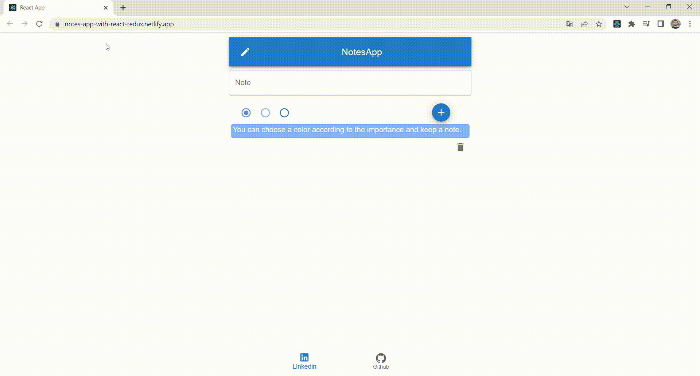

# Notes APP (React/Redux)
React.js & Redux & UI Framework: Meterialui; I developed with. Note app can be used to record important situations, ideas or actions.In the application, notes are recorded with 3 different colors according to their importance.
Saved notes can be deleted.


## Live Link of the Project
[https://notes-app-with-react-redux.netlify.app/](https://notes-app-with-react-redux.netlify.app/)

## Preview



## Requirements
```
git clone https://github.com/volkantepeli/weather-forecast-app-with-react.git
```
```
npm install
```
```
npm start
```
## Used technologies


<br>
</br>

## Reach out to me

[linkedin]: https://www.linkedin.com/in/volkantepeli/

[][linkedin]

